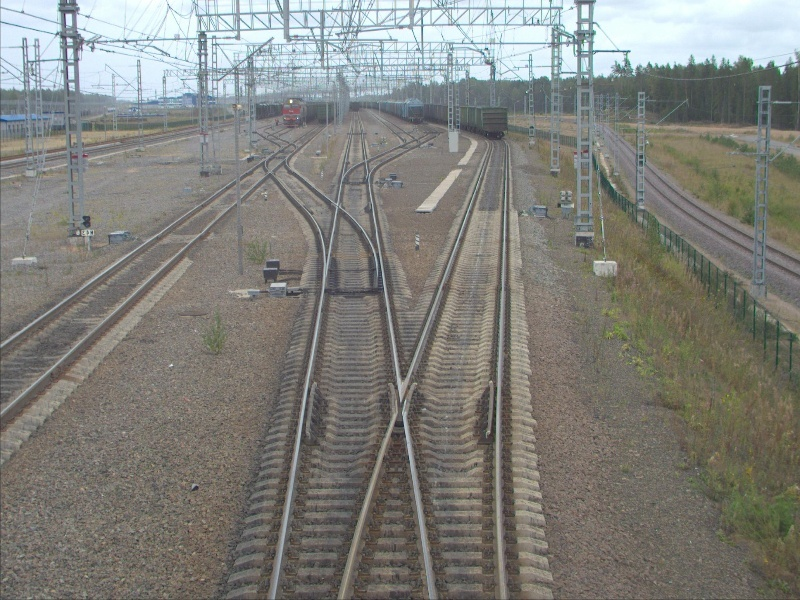
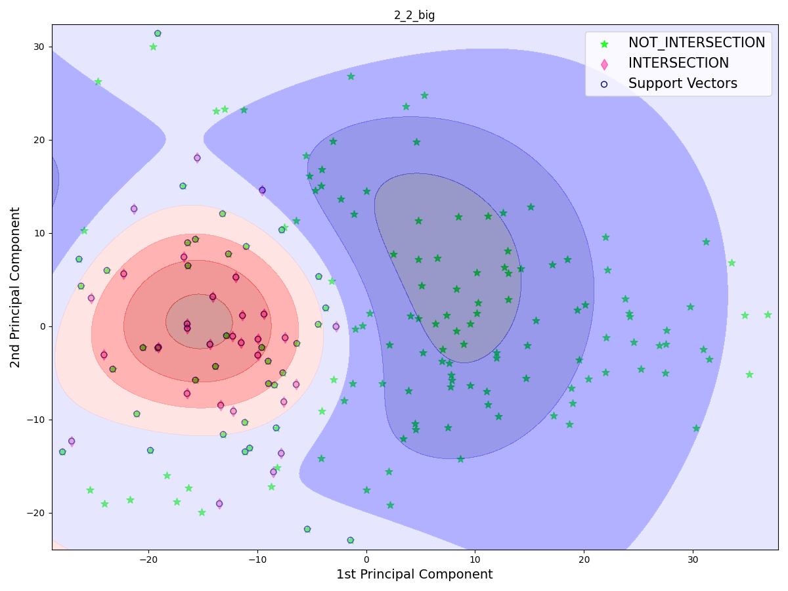
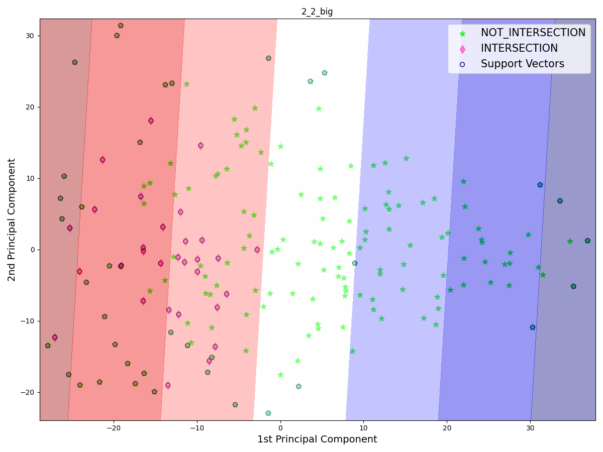
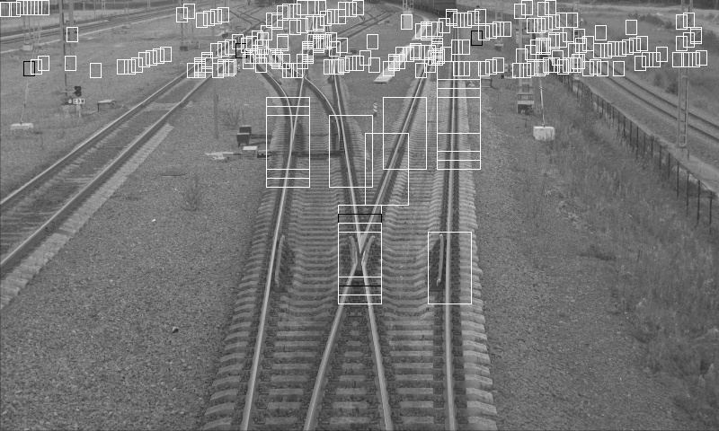
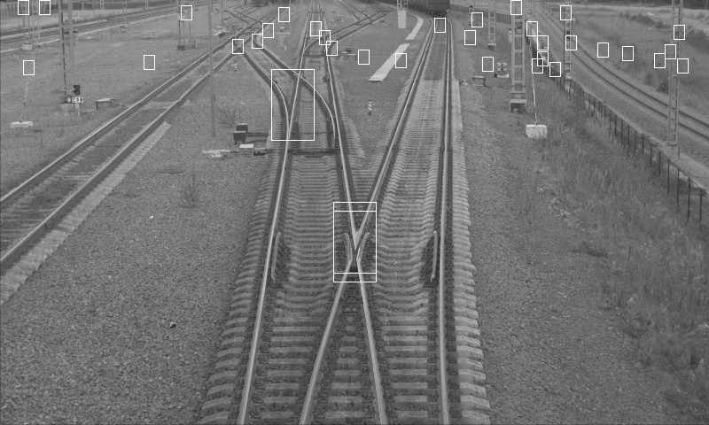
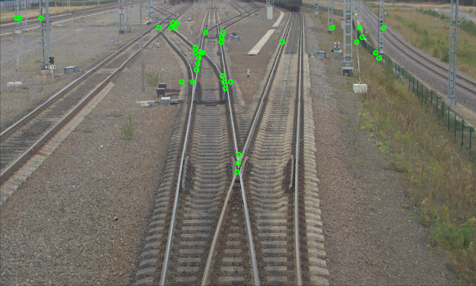
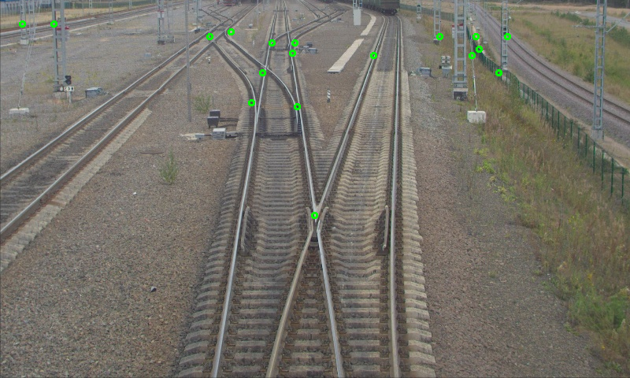
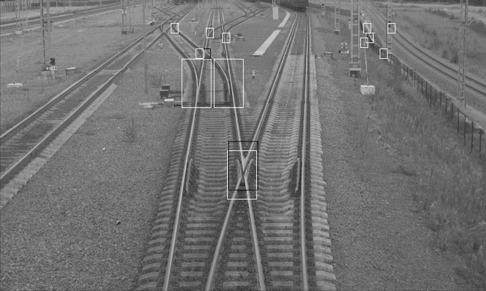

# Поставнока задачи  
На вход подается изображение — фотография сделанная с головы поезда. 
Необходимо найти на входном изображении места пересечений железно-дорожных путей. Пересечением будем называть точку, в которой пересекаются рельсы одной ж/д колеи с другой.
На выходе алгоритма должен быть набор точек, в которых было обнаружено пересечение.  
.  

# Алгоритм на основе SVM  

## Классификатор SVM    
В качестве классификатора SVM использовалась SVC из библиотеки: https://scikit-learn.org/stable/modules/generated/sklearn.svm.SVC.html.  
Реализации в этой библиотеке базируется на классической реализации из libsvm.  
Для поиска оптимальный параметров(C, gamma) использовалась техника GridSearch: https://scikit-learn.org/stable/modules/generated/sklearn.model_selection.GridSearchCV.html  
Также при обучении модели производилась кросс валидация(k-перекрестная проверка), чтобы получить адекватные результаты тестирования модели.  
Ядром классифкатора было выбрано Гауссово ядро, именно с ним данные разделяются лучше всего.
Это можно увидеть при построении графиков разделяющей гиперплоскости. Однако для этого размерность данных уменьшалась до 2 при помощи PCA: https://ru.wikipedia.org/wiki/%D0%9C%D0%B5%D1%82%D0%BE%D0%B4_%D0%B3%D0%BB%D0%B0%D0%B2%D0%BD%D1%8B%D1%85_%D0%BA%D0%BE%D0%BC%D0%BF%D0%BE%D0%BD%D0%B5%D0%BD%D1%82  
.  
.  
Замечание: до передачи в SVM входные вектора стандартизируются относительно среднего при помощи: https://scikit-learn.org/stable/modules/generated/sklearn.preprocessing.StandardScaler.html  
 
## Выбор входных векторов для SVM  
Можно заметить, что чем дальше ЖД стрелка находится на изображении, тем меньший размер имеет окно с этой стрелкой.  
Точно также и наоборот, для близких к камере стрелок окно будет большим.  
Поэтому было выбрано два разных окна - маленькое (12x16pix) и большое (48x80pix):   
1. Входной вектор для всех y < ImageHeigh / 5 считается как HOG в окне размером 12x16 пикселей. Размерности фичи HOG = 216.  
2. Входной вектор для всех y >= ImageHeigh / 5 считается как HOG в окне размером 48x80 пикселей. Размерность фичи HOG = 1620.  

## Разные классифкаторы для стрелок вида X и Y  
Так как HOG для стрелки вида X сильно отличается от HOG для стрелок вида Y - 
было решено сделать различные бинарные классификаторы для этих видов стрелок.(один многоклассовый классификатор хуже разделял данные)  

## Подготовка датасета  
При разметке для каждой стрелки теперь указывается тэг = вид стрелки (X или Y).  

## Итоговый результат  
Таким образом, исходя из надобности двух разных окон, а также двух различных видов стрелок. 
При обучении получаются 4 модели:  
1. Большое окно, вид стрелки Х.  
2. Большое окно, вид стрелки Y.  
3. Маленькое окно, вид стрелки Х.  
4. Маленькое окно, вид стрелки Y.  

Объём датасета:  
positive:  
Y_small: 134  
Y_big: 86  
X_small: 86  
X_big: 64  
positive sum: 370  
negative_small: 378  
negative_big: 239  
nagative sum: 617  
Результат тестирования моделей:  
Y_small:
Best Score:  0.8577176470588237
Best Params:  {'C': 10, 'class_weight': {1: 0.5, 0: 0.5}, 'gamma': 0.01}
Y_big:
Best Score:  0.9472285353535351
Best Params:  {'C': 10, 'class_weight': {1: 0.5, 0: 0.5}, 'gamma': 0.001}
X_small:
Best Score:  0.9605472958414134
Best Params:  {'C': 0.0001, 'class_weight': {1: 0.6, 0: 0.4}, 'gamma': 0.01}
X_big:
Best Score:  0.9979166666666668
Best Params:  {'C': 1000, 'class_weight': {1: 0.5, 0: 0.5}, 'gamma': 1e-05}

# Алгоритм поиска стрелок при помощи обученных моделей  
На вход поступает изображение ЖД путей. Далее скользящее окно размером 12x16 или 48x80 (в зависимости от координаты Y) 
проходит по всему изображению и при помощи соотвутствующих моделей предсказывает результат: стрелка или не стрелка находится 
в этом окне.  
Рассмотри результат работы данного алгоритма.  
1. Для предсказания используются все модели.
.  
2. Для предсказания используются только модели обученные для определения Х пересечений.
.  

Видно, что в случае использования всех моделей на реальном изоюражении очень много окон дают false positive результат, 
несмотря на то, что результаты тестирования достаточно хорошие score: (0.85 - 0.99). Почему так происходит - мне предстоит разобраться.  
Также видно, что при использовании ТОЛЬКО моделей обученных для поиска Х пересечений - результат получается лучше.  
Есть идея использовать SVM для подтверждения результатов, полученных в предыдущем алгоритме: https://github.com/DmitriiTunikov/rails_cross_detector/tree/develop.  
Который я улучшил и теперь его результаты достаточно адекватные:  
1. БЕЗ аппроксимации близких точек центром масс.
.  
2. С аппроксимации близких точек центром масс.
.  

Собственно, если примернить SVM только для точек, найденых в первом алгоритмe результат будет такой:  
.  

