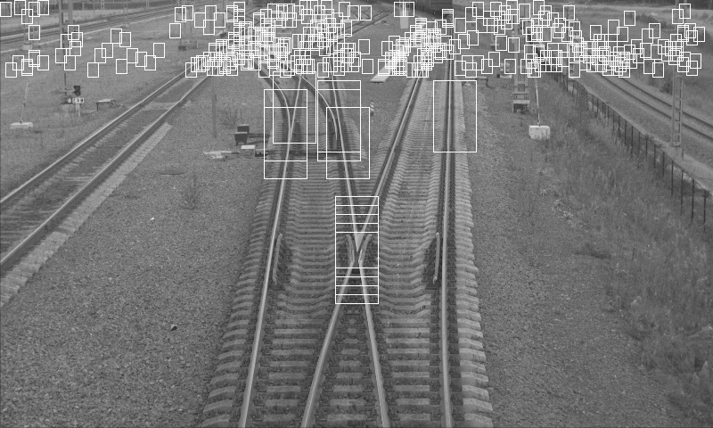

# Dataset count
| NAME  | COUNT |
| ------------- | ------------- |
|1_2_small|90|
|1_2_big|130|
|2_2_small|61|
|2_2_big|89|
|big|219|
|small|151|
|negative_small|224|
|negative_big|393|

# Model results
| NAME  | SCORE | PARAMS |
| ------------- | ------------- | ------------- |
|1_2_small|0.8675533108866442|{'C': 10, 'class_weight': {1: 0.5, 0: 0.5}}|
|1_2_big|0.9220732529398548|{'C': 10, 'class_weight': {1: 0.5, 0: 0.5}}|
|2_2_small|0.9473711473711475|{'C': 10, 'class_weight': {1: 0.5, 0: 0.5}}|
|2_2_big|0.9871117093380681|{'C': 10, 'class_weight': {1: 0.5, 0: 0.5}}| 
|big|0.9464294561291912|{'C': 10, 'class_weight': {1: 0.7, 0: 0.3}}|
|small|0.8920890626697078|{'C': 10, 'class_weight': {1: 0.5, 0: 0.5}}|

# Predicted result  
  
