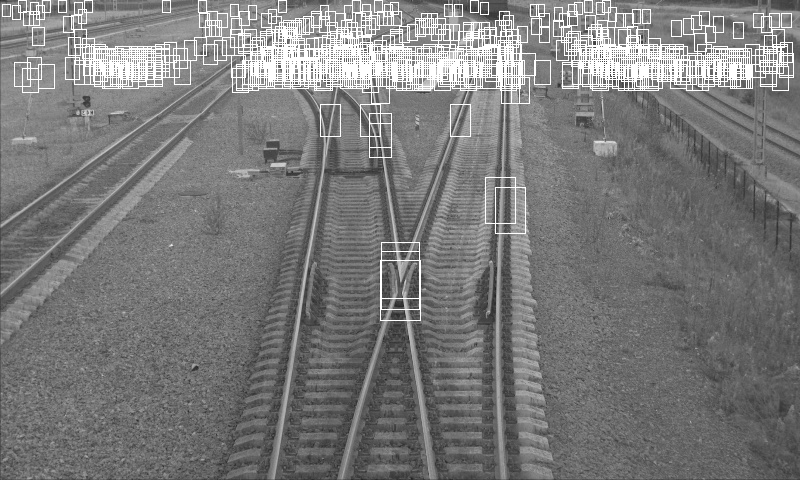

# Применение масштабирования окон  
Возникла идея, что использовать два константных размера окна (12x16 и 48х80) плохо.  
Было решено вычислять размер окна в зависимости от координаты y линейно, по формуле:   
H = int(min_win_h + (float(max_win_h) - min_win_h) / (full_heigh - max_win_h) * y)  
W = int(h_w_coef * H)  
Где full_heigh - высота изображения, а остальные параметры были взяты такими:  
h_w_coef = 0.67 (соотношение ширины окна к высоте окна)  
min_win_h = 12  
max_win_h = 80  

После вычисления текущих параметров окна, это окно вырезалось из изображения и 
масштабировалось уже к константному размеру окна (12x16 или 48х80) в зависимости 
от неравенства y > 0.2 * full_heigh. Если неравенство выполнено масштабирование происходило 
к большему окну иначе к меньшему.  
В итоге результаты предсказания стали давать результат хуже, чем до масштабирования окон.  
  

Из рисунка видно, что размер окон теперь не константный и увеличивается вместе с координатой y.  

Рассмотрим параметры датасета и результаты обучения модели:  
# Dataset count
| NAME  | COUNT |
| ------------- | ------------- |
|1_2_small|90|
|1_2_big|130|
|2_2_small|61|
|2_2_big|89|
|big|219|
|small|151|
|negative_small|224|
|negative_big|394|

# Model results
| NAME  | SCORE | PARAMS |
| ------------- | ------------- | ------------- |
|1_2_small|0.8981537598204264|{'C': 10, 'class_weight': {1: 0.5, 0: 0.5}}|
|1_2_big|0.9342596060220207|{'C': 10, 'class_weight': {1: 0.5, 0: 0.5}}|
|2_2_small|0.9526599326599327|{'C': 10, 'class_weight': {1: 0.3, 0: 0.7}}|
|2_2_big|0.9863557583587367|{'C': 1, 'class_weight': {1: 0.6, 0: 0.4}}|
|big|0.9447387417802491|{'C': 10, 'class_weight': {1: 0.7, 0: 0.3}}|
|small|0.9079287498642337|{'C': 10, 'class_weight': {1: 0.5, 0: 0.5}}|